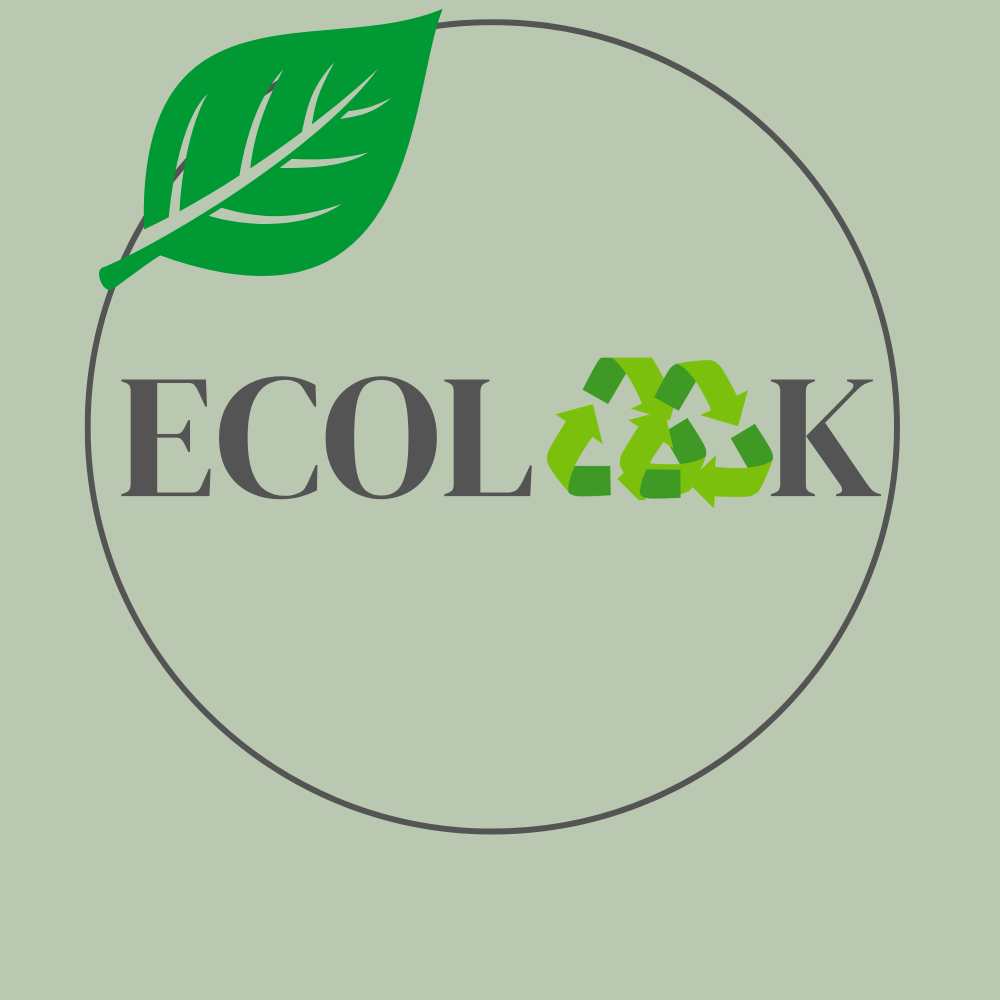

[codigonuevo.html](https://github.com/user-attachments/files/32236976/codigonuevo.html)
<!DOCTYPE html>
<html lang="es">

<head>
    <meta charset="UTF-8">
    <meta name="viewport" content="width=device-width, initial-scale=1.0">
    <title>Inicio</title>
    
</head>

<body>

    <header>
        

            

                
            

            

                <h1> Ecolook </h1>
                
"Todo tiene su lado bello pero no todos lo ven"

            

            

                <a href="codigonuevo.html" class="activo">Inicio</a>
         
            

        

        

            

                
                <a href="https://wa.me/5493517658746?text=Hola%2C%20quiero%20hacer%20una%20consulta">Mandanos un
                    Whatsapp
                </a>
            

            

                
                <a href="https://link.mercadopago.com.ar/laconsolini.mp" target="_blank" class="enlaces">Link de Mercado
                    Pago
                </a>
            

            

                
                <a href="https://www.instagram.com/eco.look2026" target="_blank" rel="noopener noreferrer"
                    class="ig-link">
                    Seguinos en Instagram
                </a>
            

        

    </header>

    <main>

        

            

                
                

                    <h2>Osito Clásico</h2>
                    
Osito de peluche suave, ideal para abrazar y decorar la habitación.

                    $8.500

                

            

            

                
                

                    <h2>Conejo Orejón</h2>
                    
Conejo de orejas largas, tela afelpada y relleno hipoalergénico.

                    $7.900

                

            

            

                
                

                    <h2>Perrito Dormilón</h2>
                    
Perrito con expresión tierna, perfecto para dormir acompañado.

                    $9.200

                

            

            

                
                

                    <h2>Gatito Curioso</h2>
                    
Gatito de peluche con ojos brillantes y colita esponjosa.

                    $8.100

                

            

            

                
                

                    <h2>Panda Bebé</h2>
                    
Panda tierno en blanco y negro, tamaño mediano.

                    $10.400

                

            

            

                
                

                    <h2>Elefante Chiquito</h2>
                    
Elefante gris de trompa larga, ideal para bebés.

                    $7.300

                

            

            

                
                

                    <h2>León Melenudo</h2>
                    
León con melena esponjosa y expresión amigable.

                    $9.800

                

            

            

                
                

                    <h2>Jirafa Alta</h2>
                    
Jirafa de cuello largo y manchas cosidas a mano.

                    $11.000

                

            

            

                
                

                    <h2>Zorro Astuto</h2>
                    
Zorro de colores cálidos, cola grande y suave.

                    $8.700

                

            

            

                
                

                    <h2>Koala Tierno</h2>
                    
Koala abrazado a una rama, textura ultra suave.

                    $9.500

                

            

            

                
                

                    <h2>Pingüino Polar</h2>
                    
Pingüino blanco y negro con bufanda tejida.

                    $8.300

                

            

            

                
                

                    <h2>Unicornio Mágico</h2>
                    
Unicornio con crin de colores y cuerno bordado.

                    $10.900

                

            

            

                
                

                    <h2>Tigre Rayado</h2>
                    
Tigre de rayas suaves y mirada juguetona.

                    $9.100

                

            

            

                
                

                    <h2>Oveja Lanuda</h2>
                    
Oveja blanca de lana simulada, muy esponjosa.

                    $7.600

                

            

            

                
                

                    <h2>Rana Saltarina</h2>
                    
Rana verde de ojos grandes y sonrisa simpática.

                    $6.900
                

            

            

                
                

                    <h2>Pulpo Multicolor</h2>
                    
Pulpo de ocho tentáculos con textura acolchada.

                    $9.900
                

            

            

                
                

                    <h2>Búho Nocturno</h2>
                    
Búho de plumas bordadas y ojos grandes redondos.

                    $8.400
                

            

            

                
                

                    <h2>Dinosaurio Amigable</h2>
                    
Dinosaurio verde con espinas suaves en el lomo.

                    $10.200
                

            

            

                
                

                    <h2>Ballena Azul</h2>
                    
Ballena grande y liviana, ideal como almohadón.

                    $12.300
                

            

            

                
                

                    <h2>Mono Trepador</h2>
                    
Mono de brazos largos con velcro en las manos.

                    $8.800
                

            

        

    </main>

    <footer>
        
&copy; 2026 Tienda Ecoloop - Todos los derechos reservados

    </footer>

</body>

</html>
